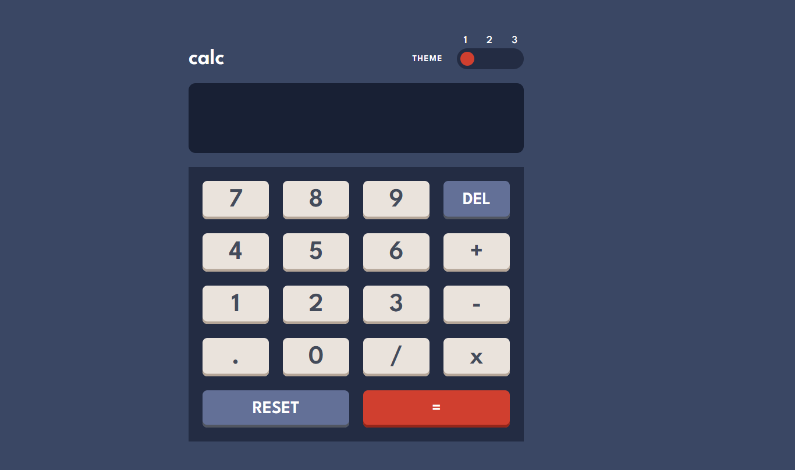

# Frontend Mentor - Calculator app solution

This is my solution to the [Calculator app challenge on Frontend Mentor](https://www.frontendmentor.io/challenges/calculator-app-9lteq5N29).

## Table of contents

- [Overview](#overview)
    - [Screenshot](#screenshot)
    - [Links](#links)
- [My process](#my-process)
    - [Built with](#built-with)
    - [What I learned](#what-i-learned)
- [Author](#author)

## Overview

### Screenshot

Screenshot of my solution :)

### Links

- Solution URL: [Solution URL](https://www.frontendmentor.io/solutions/calculator-app-solution-U77HmZoVY9)
- Live site URL: [Live site URL](https://app-calculator-challenge.vercel.app/)

## My process

### Built with

- HTML5
- CSS
- CSS flexbox
- Javascript

### What I learned

I learned to create a group of radio buttons to make it look like a slider with three options.

### Author

- Frontend Mentor - [@dan-ec05](https://www.frontendmentor.io/profile/dan-ec05)
- Github - [@dan-ec05](https://github.com/dan-ec05)